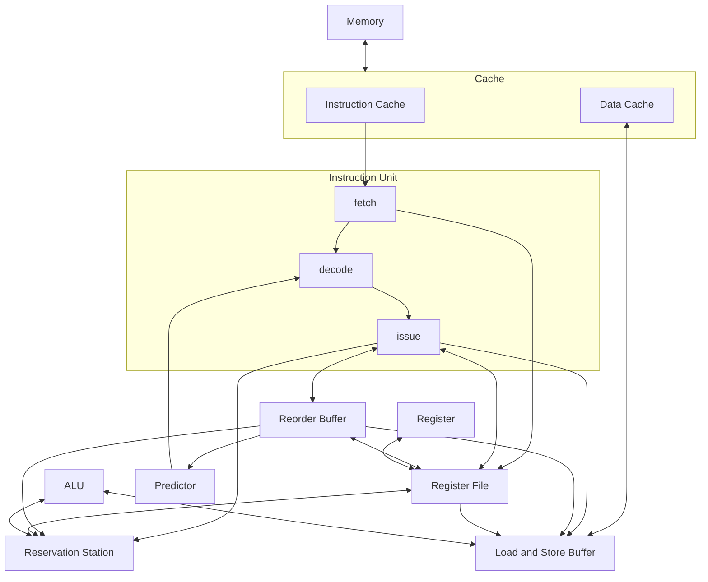

# RISC-V-CPU
RISC-V-CPU

### 架构图

```mermaid
graph 
Mem[Memory]
RS[Reservation Station]
RF[Register File]
Reg[Register]
ALU[ALU]
LSB[Load and Store Buffer]
RoB[Reorder Buffer]
Predictor[Predictor]
subgraph Cache
	ICache[Instruction Cache]
	DCache[Data Cache]
end
subgraph Instruction Unit
	Fetch[fetch]
	Decode[decode]
	Issue[issue]
end

%%LSB --> Mem
Mem <--> Cache
ICache --> Fetch
Fetch --> RF
Fetch --> Decode
Decode --> Issue
DCache <--> LSB
Issue <--> RoB
%%RoB --> InstructionUnit
Issue --> RS
Issue --> LSB
Issue <--> RF
Predictor --> Decode
RoB --> RS
RoB --> LSB
RoB <--> RF
RF --> LSB
RF <--> RS
Reg <--> RF
ALU <--> RS
ALU <--> LSB
RoB --> Predictor

```

